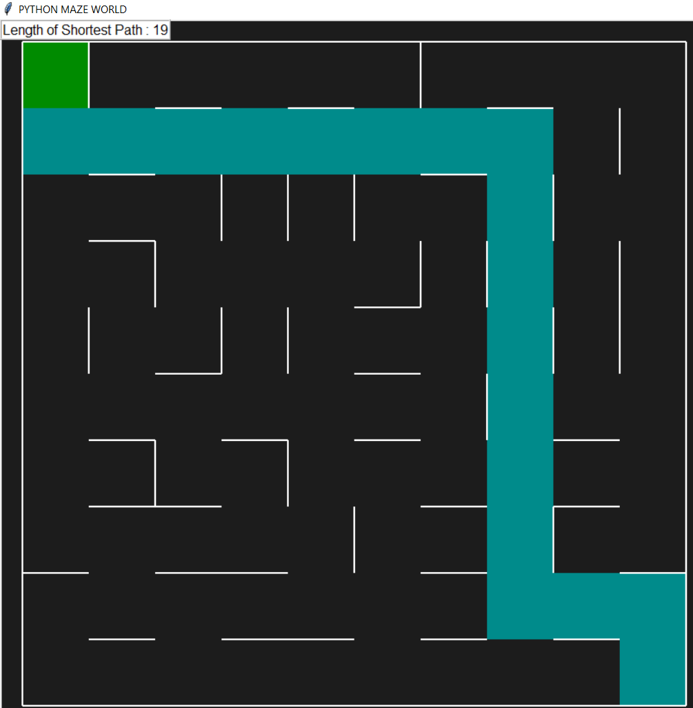
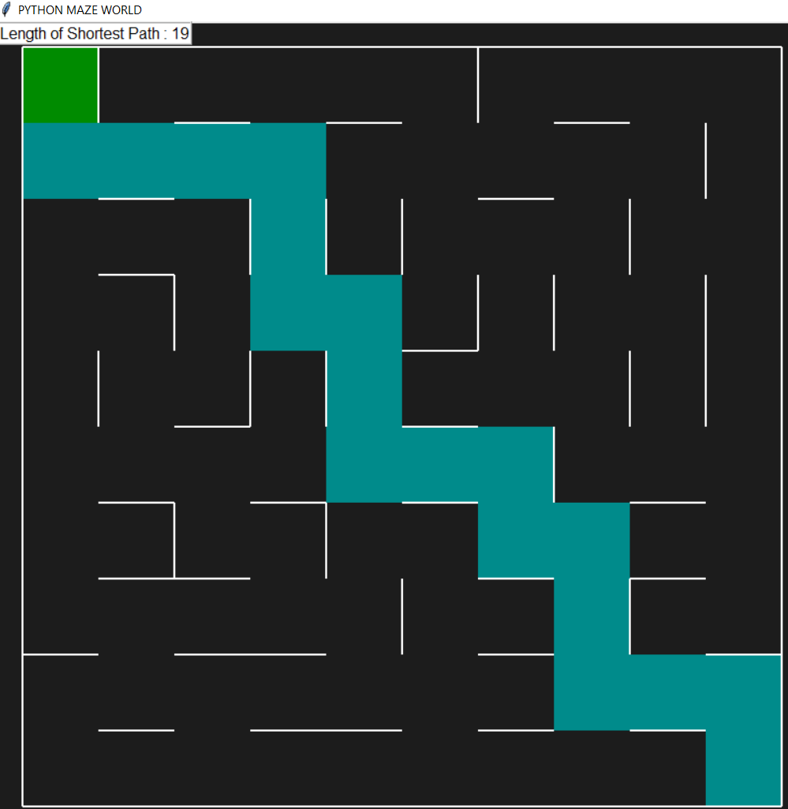

# AI-Maze-Solver
This project contains the implementation of various search techniques, including DFS, BFS, A* Search, and MDP algorithms (Value Iteration and Policy Iteration) for solving a maze. This project aims to compare the performance of these techniques in terms of finding the shortest path in the maze.

  
   
    

# Search Algorithms

## DFS Algorithm
DFS is a graph traversal algorithm that explores as far as possible along each branch before backtracking. In the context of maze solving, DFS explores the maze by always choosing the path with the deepest unexplored cell.

## BFS Algorithm
BFS is an algorithm that explores all the neighboring nodes at the current depth (breadth-wise exploration) before moving to the next level. In the maze solving context, BFS explores all the neighbors of a node before moving to the next level of nodes.

## A* Algorithm
A* is a heuristic search algorithm that is widely used in pathfinding and graph traversal. It uses a heuristic function to evaluate the cost of a path and chooses the path with the lowest cost. In the context of maze solving, A* explores the maze by always choosing the path with the lowest estimated cost to the goal.

Unlike DFS and BFS, which are uninformed search algorithms, A* is an informed search algorithm that takes into account the closeness of the goal when deciding the next move.

## MDP Value Iteration
Value iteration is an algorithm used to compute the optimal value function for a Markov Decision Process. In the context of a maze, value iteration would involve assigning a reward to each state in the maze and then iteratively updating the value of each state until convergence. The optimal policy for the maze can then be derived from the optimal value function.

## MDP Policy Iteration
Policy iteration is another algorithm used to compute the optimal value function for a Markov Decision Process. Policy iteration would involve iteratively improving the policy until convergence. The values used in this algorithm are the same as in Value Iteration, and the policy for all the states is initially set as a random policy.

# Performance Comparison

The performance of the implemented algorithms is compared in this section. For this comparison, three mazes of sizes 5 x 5, 4 x 7, and 10 x 10 are generated. Each algorithm is run on each of the three mazes, and the different performance parameters are calculated across all runs.

To compare the performance of the different search algorithms, the time taken by each algorithm to solve the maze, the number of nodes expanded, and the length of the shortest path found by each algorithm for each of the three mazes are measured. These parameters are a good indicator of the efficiency of these algorithms.

# Usage 

To use this code, first install the required packages by running the command:

`pip install -r requirements.txt`

To run DFS, use the following function:

`DFS()`

To run BFS, use the following function:

`BFS()`

To run A*, use the following function:

`aStar()`

To run value iteration, use the following function:

`mdp_value_iteration()`

To run policy iteration, use the following function:

`mdp_policy_iteration()`

Note that the above commands will run on a 10 x 10 saved maze present in the project directory.

## Performance Comparison

### Search Algorithm Comparison

To compare the performance of the different search algorithms, I measured the time taken by each algorithm to solve the maze, the number of nodes expanded, and the length of the shortest path found by each algorithm for each of the three mazes. The following tables show the results for all the three mazes:

#### 5 x 5 Maze Results

| Technique/Metric | Path Length | Time Taken (seconds) | Search Space |
| --- | --- | --- | --- |
| DFS | 11 | 0.017 | 16 |
| BFS | 9 | 0.031 | 25 |
| A* | 9 | 0.058 | 11 |

#### 4 x 7 Maze Results

| Technique/Metric | Path Length | Time Taken (seconds) | Search Space |
| --- | --- | --- | --- |
| DFS | 10 | 0.015 | 14 |
| BFS | 10 | 0.036 | 28 |
| A* | 10 | 0.066 | 12 |

#### 10 x 10 Maze Results

| Technique/Metric | Path Length | Time Taken (seconds) | Search Space |
| --- | --- | --- | --- |
| DFS | 21 | 0.031 | 22 |
| BFS | 19 | 0.275 | 100 |
| A* | 19 | 0.195 | 28 |
 
Tables 1, 2, and 3 show the results of the experiments for each maze size. From the results, we can observe that DFS is faster than BFS and A* and has a smaller search space than BFS, but it does not always find the shortest path. On the other hand, both BFS and A* can find the shortest path, but BFS takes more time and search space than A*.

### MDP Algorithm Comparison

To compare the MDP value and policy iteration algorithms, I measured memory usage and time taken for each algorithm. The following tables show the results for all the three mazes:

#### 5 x 5 Maze Results

| Technique/Metric | Memory Used (bytes) | Time Taken (seconds) |
| --- | --- | --- |
| Value Iteration | 3877574 | 0.011 |
| Policy Iteration | 3877518 | 0.002 |

#### 4 x 7 Maze Results

| Technique/Metric | Memory Used (bytes) | Time Taken (seconds) |
| --- | --- | --- |
| Value Iteration | 3877874 | 0.011 |
| Policy Iteration | 3877798 | 0.002 |

#### 10 x 10 Maze Results

| Technique/Metric | Memory Used (bytes) | Time Taken (seconds) |
| --- | --- | --- |
| Value Iteration | 3888822 | 0.086 |
| Policy Iteration | 3891166 | 0.022 |

 
Tables 4, 5, and 6 show the results of the experiments for each maze size. From the results, we can observe that Policy Iteration is faster in terms of time taken than Value Iteration for all three experiments. In addition, we notice that when the maze size is small, the memory usage of Policy Iteration is less than Value Iteration, but as the maze size increases, it uses more memory than Value Iteration.

# Conclusion
In conclusion, the implemented search algorithms (DFS, BFS, and A*) showed different performances when solving mazes of varying sizes. The results showed that DFS is fast and has a smaller search space, but it doesn't find the shortest path. BFS and A* are able to find the shortest path, but BFS takes more time and has a larger search space compared to A*. Therefore, in scenarios where finding the shortest path is essential and the maze is not too large, A* would be a good choice. In scenarios where the maze is larger and finding the shortest path is not as important, DFS would be a better choice due to its speed and smaller search space. BFS would be a good compromise between the two in scenarios where both speed and finding the shortest path are important.

Regarding MDP, the performance of the implemented value iteration and policy iteration algorithms showed convergence to an optimal value function and policy for a given maze. The value iteration algorithm performed well with a reasonable gamma value and convergence criterion. The policy iteration algorithm, on the other hand, can perform well in specific scenarios, especially when the maze is relatively small. However, the algorithm can be computationally expensive and may not converge in large mazes or complex environments.

Overall, the choice of algorithm depends on the specific requirements of the problem at hand, including the size of the maze, the importance of finding the shortest path, the trade-off between speed and accuracy, and the computational resources available.

